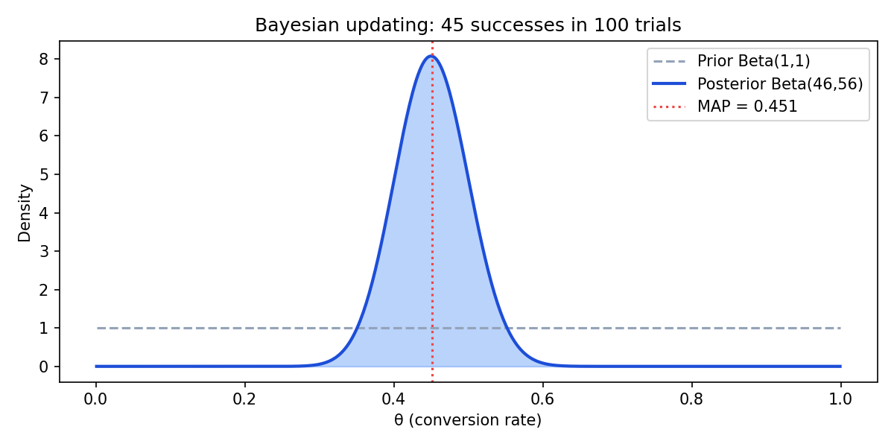
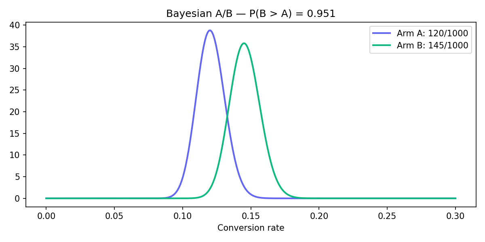
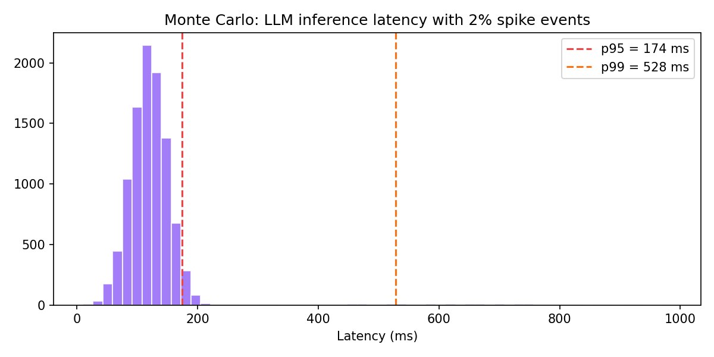

# mitx-6431x-bayesian-ab

**MITx 6.431x — Probability: The Science of Uncertainty and Data**

Probabilidade e incerteza aplicadas a sistemas de IA: inferência bayesiana via MCMC, testes A/B com posteriors conjugados e quantificação de risco operacional por simulação Monte Carlo.

---

## Resultados em destaque

| Análise | Resultado | Interpretação |
|---------|-----------|---------------|
| Beta-Bernoulli (45/100) | Posterior mean = **0.451** | Taxa de conversão estimada com prior uniforme |
| A/B bayesiano (120 vs 145 em 1000) | **P(B > A) = 0.951** | Evidência forte de superioridade do braço B |
| Latência LLM (MC) | p95 ≈ **177 ms**, p99 ≈ **612 ms** | Cauda pesada por 2% de spikes |

---

## Figuras

### Atualização bayesiana (conjugacy Beta-Bernoulli)



A posterior analítica `Beta(α+s, β+n−s)` coincide com a média MCMC — validação do sampler Metropolis-Hastings.

### Teste A/B bayesiano



Em vez de p-value frequentista, reportamos **P(θ_B > θ_A)** integrando sobre as posteriors.

### Monte Carlo — latência de inferência



Modelo: `N(120, 30)` com probabilidade 2% de multiplicador ×5 — típico de cold-start GPU ou cache miss.

---

## Módulos

| Módulo | Método | Comando |
|--------|--------|---------|
| `mcmc/` | Metropolis-Hastings, random-walk | `python mcmc/run.py` |
| `ab-testing/` | Beta posterior, `P(B>A)` | `python ab-testing/run.py` |
| `risk-uncertainty/` | Simulação latência/custo/falhas | `python risk-uncertainty/run.py` |

## Fundamentos teóricos

**Bayes:**
```
P(θ|D) ∝ P(D|θ) · P(θ)
```

**Metropolis-Hastings:** aceitar proposta `θ'` com probabilidade `min(1, P(θ'|D)/P(θ|D))`.

**Perda esperada (risco operacional):**
```
E[Loss] ≈ (1/N) Σᵢ lossᵢ   via Monte Carlo
```

## Setup

```bash
python3 -m venv .venv && source .venv/bin/activate
pip install -r requirements.txt
python docs/generate_figures.py   # regenerar plots
```

## Portfólio

- [Portfolio AI Engineer / CTO](https://portfolio-ai-cto-guaranta.netlify.app)
- [Bayes e cybersecurity](docs/portfolio-link.md)

## Autor

**Guarantã Almeida** — [github.com/guaranta](https://github.com/guaranta)
